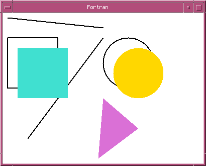

# f03xlib
An `iso_c_binding` interface to Xlib for Fortran 2003/2008. Currently, only a
subset of Xlib is implemented.

## Build
You can use the provided Makefile to compile everything. Build the interface with:
```
$ make xlib
```
Or run your favourite Fortran compiler directly:
```
$ gfortran8 -c xlib.f90
```

## Examples


Example programmes utilising the interface can be found in the directory `examples`:

* **window** displays a simple window.
* **events** captures X11 events.
* **drawing** draws some shapes on the window.
* **starfield** flys through a starfield.
* **wireframe** renders a wire-frame model of a Tie Fighter.
* **mandelbrot** draws a Mandelbrot set.

Build them with BSD make:
```
$ make window
$ make events
$ make drawing
$ make starfield
$ make wireframe
$ make mandelbrot
```

Without BSD make, compile the examples manually, for instance:
```
$ gfortran8 -o window -Wl,-rpath=/usr/local/lib/gcc8/ -I/usr/local/include/ -L/usr/local/lib/ examples/window.f90 xlib.o -lX11
```

## Licence
ISC
